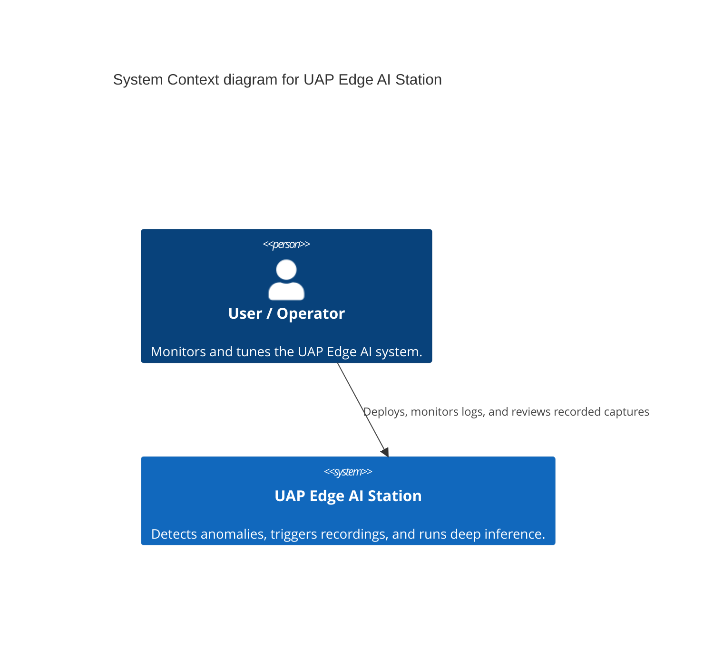
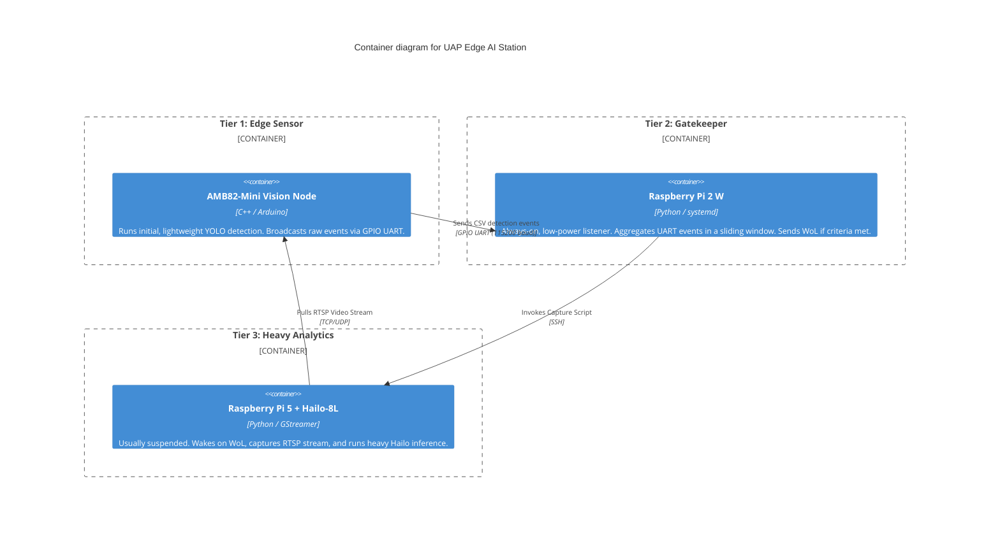

# Architecture

This document describes the architectural layout of the **UAP Edge AI Station**, using the C4 Model.

## C4 Context

The UAP Edge AI Station is a multi-tier physical detection mesh designed to capture, classify, and record anomalous aerial phenomena while minimizing idle power usage.

## C4 Container

The core system consists of three distinct hardware tiers operating in a staggered, event-driven escalation pipeline to conserve power while maximizing inference performance during bursts.

## Hardware Interfaces
- **AMB82-Mini ↔ Pi 2 W:** 3-Wire GPIO Crossover (`D21 -> RXD`, `D22 -> TXD`, `GND -> GND`).
- **Pi 2 ↔ Pi 5:** Local Network (Ethernet / WiFi) with Static DHCP for Magic Packet target consistency.
- **Power Delivery:** Separate 5V/3A+ delivery to Pi 5; low-current draw for AMB82 and Pi 2 W.
